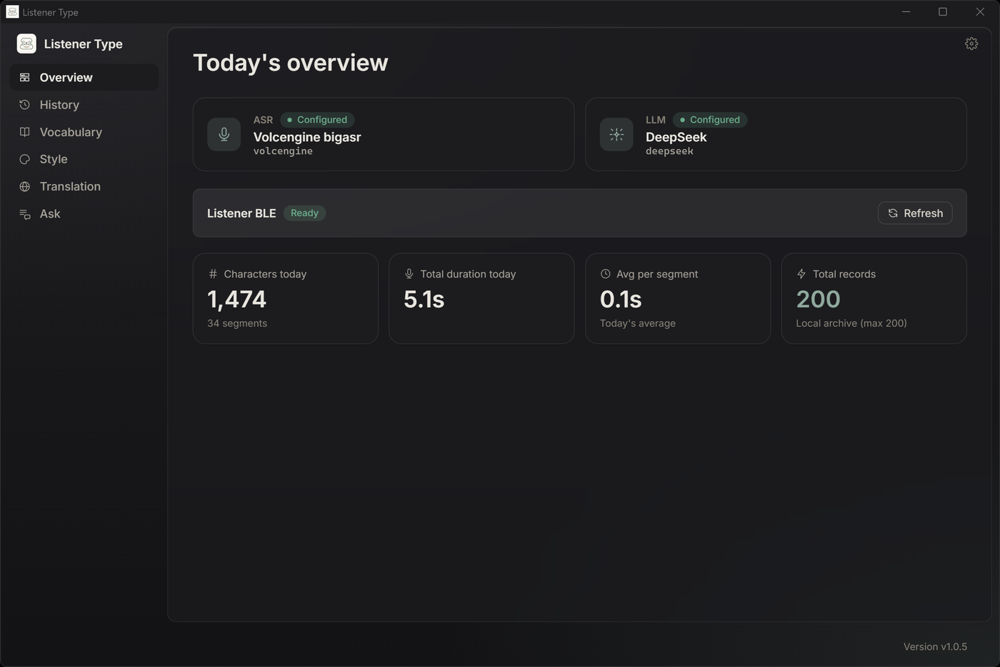
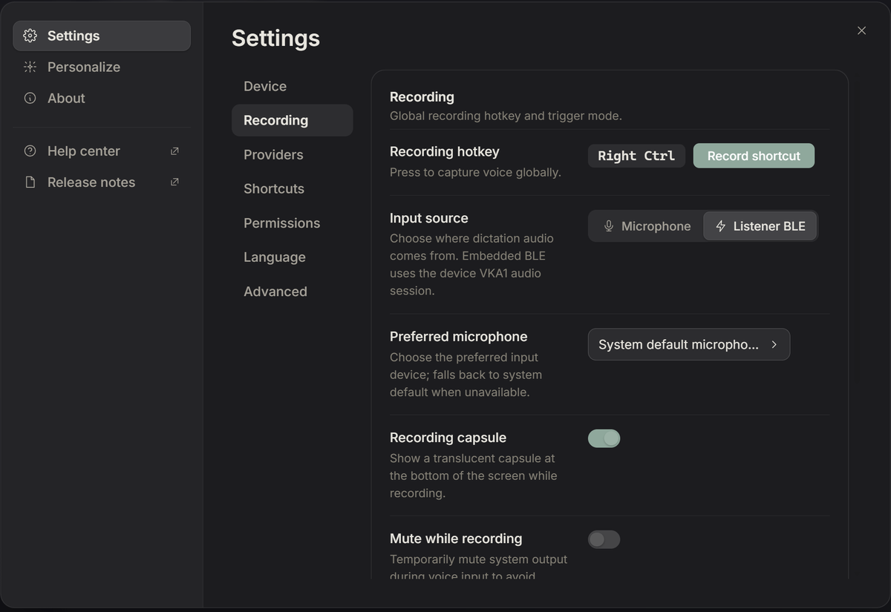

<p align="center">
  
</p>

# Listener Type

Speak where you work. Listener Type turns speech into text at the current cursor, then optionally cleans, structures, or translates it. Use a computer microphone on Windows, macOS, or Linux; add the Listener voice keyboard for physical recording controls, Bluetooth audio, status lights, and device settings.

[简体中文](README.zh.md) · [繁體中文](README.zh-TW.md) · [Download](https://github.com/Listener-ai-Macau/Listener-Type/releases) · [Usage guide](docs/USAGE.md) · [Feature catalog](docs/product/features.md)

<p align="center">
  
</p>

## One product, two repositories

| Part | What it owns | Repository |
| --- | --- | --- |
| Listener Type | Recording sessions, speech recognition, text processing, cursor insertion, settings, history, and the desktop device experience | This repository |
| Listener Firmware | Microphone capture, BLE audio and HID, keys, knob, LEDs, battery and power management, diagnostics, and OTA | [Listener-Firmware](https://github.com/Listener-ai-Macau/Listener-Firmware) |

The app works without the keyboard. The keyboard extends the same dictation flow; it does not perform recognition by itself.

## Try it in 30 seconds

1. Install the latest Windows MSI from [Releases](https://github.com/Listener-ai-Macau/Listener-Type/releases), or build the app for macOS/Linux.
2. Allow microphone access, select **Computer microphone** under Settings → Recording, and pick a recognition engine: paste a cloud API key, or download a local model (on macOS, Apple Speech works with no setup).
3. Focus a text field, press Right Ctrl on Windows, speak, then press it again. On macOS the default is Right Option.

The result returns to the original cursor. If the target app blocks direct insertion, Listener keeps the text on the clipboard and asks you to paste it. Press `Esc` to cancel an active recording.

## What Listener includes

| Area | Capabilities |
| --- | --- |
| Dictation | Toggle-to-record, manual stop, automatic end, cancellation, live capsule preview, computer microphone, and Listener BLE audio |
| Recognition | Volcengine streaming, OpenAI-compatible batch ASR, Apple Speech, Bailian realtime, macOS Qwen local ASR, and Windows Foundry Local Whisper |
| Writing | Raw, Light, Structured, and Formal styles; filler cleanup; punctuation; correction rules; translation; custom style packs with ZIP import/export |
| Personal vocabulary | Local names, terms, abbreviations, and hotwords used by supported recognition and polish providers |
| Follow-up tools | Ask about selected text, restyle the previous result, and use configurable global shortcuts |
| Output | Insert into the focused field, clipboard fallback, optional Windows TSF validation path, and macOS Accessibility insertion |
| History | Local session history, previous results, retention controls, and optional diagnostic recording |
| Providers | Bring your own cloud keys or use supported local engines; direct, system-proxy, or custom-proxy routing per provider |
| Desktop | Tray controls, autostart, single-instance handling, dark mode, updater UI, permissions, and exportable diagnostics |
| Voice keyboard | Pairing, connection health, four configurable keys, clickable/rotary knob, LED brightness, low-power timers, battery status, over-the-air (OTA) firmware updates, and recovery |

## From speech to the cursor

<p align="center">
  
</p>

> **You say:** "um tomorrow, the, the 3pm meeting, can you remind me"
>
> **You get:** Remind me about the 3pm meeting tomorrow.

Light removes standalone filler words and restores punctuation while preserving meaning. Structured organizes requests and notes. Formal tidies business writing. Raw keeps the recognition result close to what was said. Translation uses the selected target language. If a polish provider is unavailable, Listener preserves a usable raw result instead of losing the dictation.

## The Listener voice keyboard

<p align="center">
  
</p>

Pair the keyboard in Settings → Device. Click the knob to start or stop recording, double-click to reset pairing, long-press to power off, and rotate it for volume or brightness. KEY1–KEY4 support configurable single-, double-, and long-press actions. Six lights — PWR, BLE, REC, AI, OK, WARN — speak for the device; the full vocabulary is in the firmware's [light language](https://github.com/Listener-ai-Macau/Listener-Firmware#reading-the-lights).

Voice-triggered recording can listen for a configurable wake phrase, with three guided voiceprint samples as an optional input guard. Voiceprint is not authentication. Firmware updates run from Listener Type and preserve pairing and device settings during a normal OTA.

See the [voice keyboard handbook](docs/quickstart/voice-keyboard-readme.md) and [firmware repository](https://github.com/Listener-ai-Macau/Listener-Firmware).

<p align="center">
  
</p>

## Local-first by design

Settings, history, vocabulary, styles, and correction rules stay on the computer. Provider credentials use the OS credential store; no provider key ships with the app. Optional debug audio is off by default. The exported diagnostic package is designed to report product and connection state without API keys, recordings, or transcript text.

The product loop does not require a Listener-operated backend. Remote marketplace and account features remain disabled unless a compatible backend is explicitly configured.

## Platform support and current limits

| Platform or feature | Current scope |
| --- | --- |
| Windows | Primary release path; computer microphone, Listener BLE audio/device controls, packaging, and cursor insertion |
| macOS 12+ | Computer microphone, Apple/local recognition paths, global shortcut, and Accessibility insertion |
| Linux | Computer microphone; X11 global shortcut is best effort, while Wayland uses desktop-bound CLI commands |
| Automatic wake and voiceprint | Input convenience and interference reduction; validate final text in noisy or far-field use |
| Multiple or overlapping speakers | Still under active repair and not guaranteed in release 1.0.5 |
| Windows input method | The standard installer inserts into the focused field; it does not register Listener as a system IME |

These limits are part of the product contract. Detailed behavior is tracked in the [feature catalog](docs/product/features.md).

## Release history

| Release | Product milestone |
| --- | --- |
| 1.0.1 | Consolidated the Listener-only desktop surface and its first packaged recognition/preview flow |
| 1.0.3 | Accepted wake-sensitivity and false-trigger refinements with the matching firmware transfer path |
| 1.0.4 | Established the single-user wake, pause continuation, automatic ending, and insertion baseline; multi-speaker isolation remained experimental |
| 1.0.5 | Improved wake-to-body continuity, capsule/final separation, quiet wake capture, and keyboard feedback; far-field and overlapping-speaker reliability remain active work |

Exact artifacts, checksums, and changes are kept on the [GitHub Releases page](https://github.com/Listener-ai-Macau/Listener-Type/releases).

## Download and documentation

- [Latest releases](https://github.com/Listener-ai-Macau/Listener-Type/releases)
- [1.0.5 release notes](docs/release/1.0.5.md)
- [Usage guide](docs/USAGE.md)
- [Product feature catalog](docs/product/features.md)
- [Voice keyboard and device recovery](docs/quickstart/voice-keyboard-readme.md)
- [Security policy](SECURITY.md)

## Build from source

Listener Type uses Tauri 2, Rust, React, TypeScript, and Vite.

```bash
npm ci
npm run build
cargo check --manifest-path src-tauri/Cargo.toml
```

A full desktop build also needs the `third_party/denzic-platform` submodule. Read [CONTRIBUTING.md](CONTRIBUTING.md) before contributing. Listener Type is open source under the [Apache-2.0 license](LICENSE).
