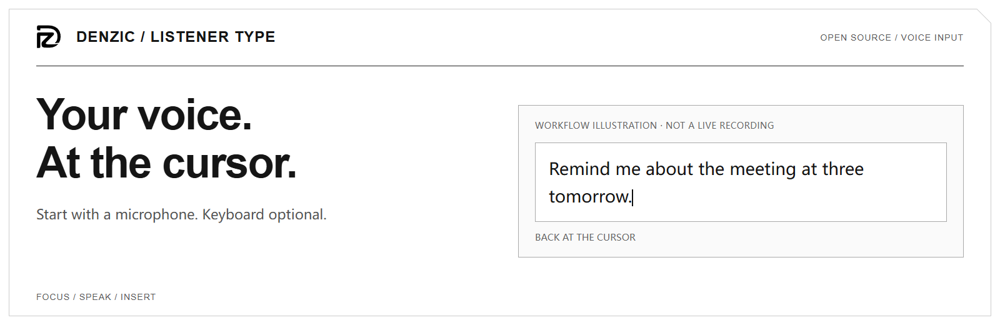
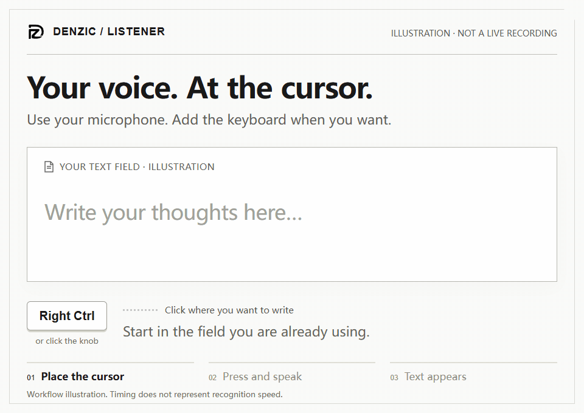
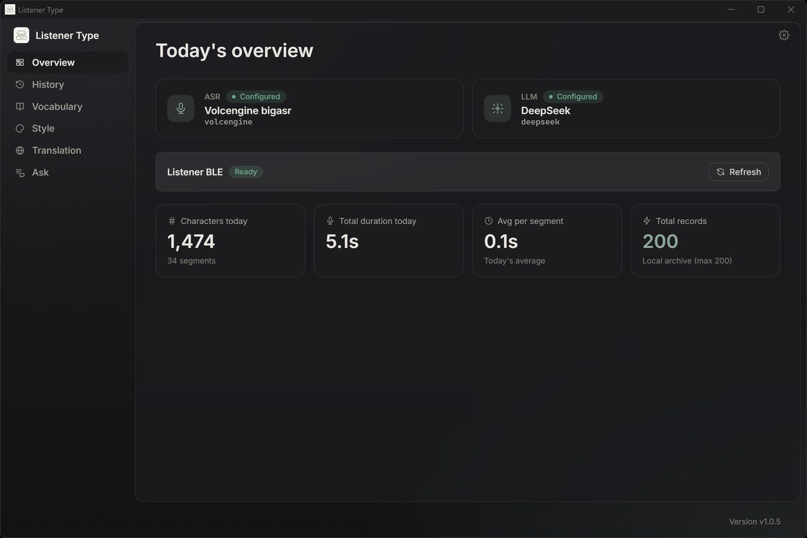

<picture>
  <source media="(prefers-color-scheme: dark) and (max-width: 600px)" srcset="docs/assets/listener/type-hero-en-mobile-dark.png">
  <source media="(prefers-color-scheme: dark)" srcset="docs/assets/listener/type-hero-en-dark.png">
  <source media="(max-width: 600px)" srcset="docs/assets/listener/type-hero-en-mobile.png">
  
</picture>

**English** · [Chinese](README.zh-CN.md)

# Listener Type

**Speak a longer message, an email or a note. Keep the text in the field you are already using.**

**[Download for Windows](https://github.com/Listener-ai-Macau/Listener-Type/releases)** · [First setup](#make-your-first-dictation) · [Foldout manual](docs/manuals/Listener-fold-EN.pdf)

Free and open source · Keyboard optional · Set up a recognition service or local model first.


## Stay where you are writing

<picture>
  <source media="(prefers-reduced-motion: reduce) and (max-width: 600px)" srcset="docs/assets/listener/Listener-demo-en-mobile-poster.png">
  <source media="(prefers-reduced-motion: reduce)" srcset="docs/assets/listener/Listener-demo-en-poster.png">
  <source media="(max-width: 600px)" srcset="docs/assets/listener/Listener-demo-en-mobile.gif">
  
</picture>

1. Place the cursor in the destination field.
2. Press Right Ctrl, speak, then press it again to stop.
3. Review the inserted text; follow the paste prompt if insertion is blocked.

This illustrates the workflow; it is not a live recording. Raw keeps the original by default. Choose a style or translation when needed.

## Make your first dictation

| What you have | Where to start |
| --- | --- |
| A computer | Install, allow microphone access, and select **Computer microphone** in Settings → Recording. |
| A Listener keyboard | Pair `listener` in Settings → Device, check readiness and select **Listener BLE** input. |

Then configure the recognition provider's credentials/model, or prepare a runtime and model in local-ASR settings. Try one sentence in a plain text editor before using it in your daily work.

Windows is the primary installation and full keyboard-audio path. macOS / Linux currently use source builds; see platform scope below.

### Free app, separate service costs

The app is free; cloud costs are set by each provider. Without an API key, prepare a Windows local model and start with Raw.

<details>
<summary>Expand costs, local models and first-use setup</summary>

- **The app:** Listener Type is free and open source. Normal local use needs no Listener account, and the keyboard is optional.
- **Cloud services:** Bring your own recognition or text-provider credentials. Charges, quotas and trial terms are set by each provider. No cloud keys are bundled.
- **No API key:** On Windows, prepare the Foundry Local runtime and a Whisper model in local recognition settings. Choose your computer microphone and try Raw dictation. Local recognition needs no cloud ASR key; download the model first. Speed depends on your computer. Styles, translation and voice QA have separate service requirements.

[Recognition services and local model setup](docs/USAGE.en.md#recognition-services-and-local-models)

</details>

## Choose how your words come out

| Your task | What to use |
| --- | --- |
| Keep the original wording | Raw dictation, recording-capsule preview, cursor insertion and clipboard fallback |
| Tidy a message, email or task list | Light / Structured / Formal; editable styles with ZIP import/export |
| Write in another language | Select a target, then tap Shift during recording |
| Help with names and terminology | Local vocabulary, presets and literal correction rules |
| Ask about a passage | Select text, open QA with Ctrl+Shift+;, then use the recording key to ask |
| Recover previous text | History, copy, delete and retention controls |

Streaming insertion is enabled in preferences by default; actual incremental insertion depends on the platform, mode and provider. Text in the recording capsule is a preview, not confirmation that it has been inserted into the target field.

**QA setup:** Voice questions currently use Volcengine streaming ASR. Configure its App Key / Access Key and a text provider; another ASR provider or local model selected for dictation does not replace this requirement.

**Raw is the default.** Styles and translation require configuration. For example, Light may turn “um, remind me about tomorrow's three o'clock meeting” into “Remind me about tomorrow's 3 pm meeting.” This illustrates a style, not a guaranteed output.

## One knob. Four keys. Six status lights.

**The optional keyboard is in its presale phase; a purchase link has not been announced. You can use the app on its own now.**

<picture>
  <source media="(prefers-color-scheme: dark) and (max-width: 600px)" srcset="docs/assets/listener/usage-scene-en-mobile-dark.png">
  <source media="(prefers-color-scheme: dark)" srcset="docs/assets/listener/usage-scene-en-dark.png">
  <source media="(max-width: 600px)" srcset="docs/assets/listener/usage-scene-en-mobile.png">
  
</picture>

Repository keyboard photo and app screenshot; the computer, input field and sample text are illustrated.

Connect in Settings → Device. Click the knob to start/stop, rotate for volume, double-click to reset pairing, or hold until shutdown confirms. Customize click, double-click and long-press actions on the four keys.

Configure wake phrase and voiceprint in **Device settings**. Enroll with three samples of the current phrase, and enroll again after changing it. Voiceprint reduces input interference; review the final result in noise or overlapping speech. Deleting the voiceprint does not disable voice wake. Enrollment creates a protected local template; original sample recordings are not retained after enrollment.

[Hardware controls and light language](https://github.com/Listener-ai-Macau/Listener-Firmware) · [Foldout manual](docs/manuals/Listener-fold-EN.pdf)

## Configure the services and understand the data flow

Settings, vocabulary, styles and history are local. Credentials use the OS credential store. Cloud ASR processes audio; cloud polishing, translation and QA process relevant text. Local ASR with a cloud text provider still sends text. Debug audio is off by default.

Choose direct, system-proxy or custom-proxy routing per provider. The remote marketplace is unconfigured by default; normal local use does not require a Listener backend or account.

## Platform scope

| Platform | Current path |
| --- | --- |
| Windows | MSI; computer microphone and primary Listener BLE audio/device configuration path |
| macOS 12+ | Planned: Apple Speech recognition, Accessibility insertion, packaged app. Today: build from source — computer microphone, local-model recognition, global shortcut |
| Linux | Source build; computer microphone; best-effort X11 shortcuts or desktop-bound CLI commands on Wayland |

The standard installer does not register a system IME. Wake and voiceprint do not guarantee speaker separation at every distance or in every noisy environment.

<details>
<summary>View the app interface</summary>



Existing repository screenshot; statistics and provider settings are examples.

</details>

## Documentation and development

For connection, recording or insertion problems, start with panel 08 of the foldout. If the issue persists, read [Support](SUPPORT.md) and [report the issue](https://github.com/Listener-ai-Macau/Listener-Type/issues) with your app version, operating system and input source. Include the firmware version when using the keyboard.

[Usage](docs/USAGE.en.md) · [Feature catalog](docs/product/features.en.md) · [Releases](https://github.com/Listener-ai-Macau/Listener-Type/releases) · [Contributing](CONTRIBUTING.md) · [Security](SECURITY.md)

Tauri 2 / Rust / React / TypeScript / Vite. Full desktop builds also require the `third_party/denzic-platform` submodule.

```bash
npm ci
npm run build
cargo check --manifest-path src-tauri/Cargo.toml
```

App and firmware have separate open-source repositories.

[Apache-2.0](https://github.com/Listener-ai-Macau/Listener-Type/blob/master/LICENSE)
