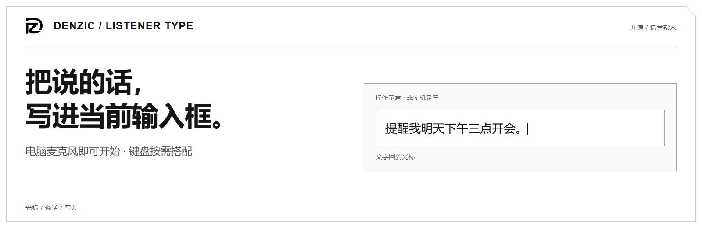
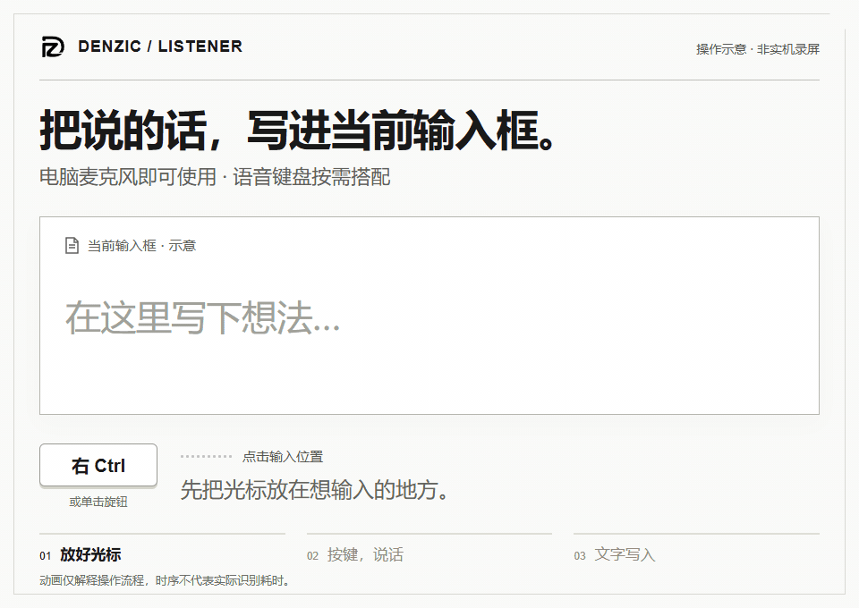
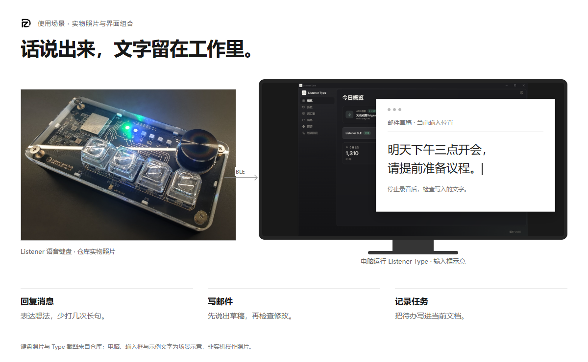
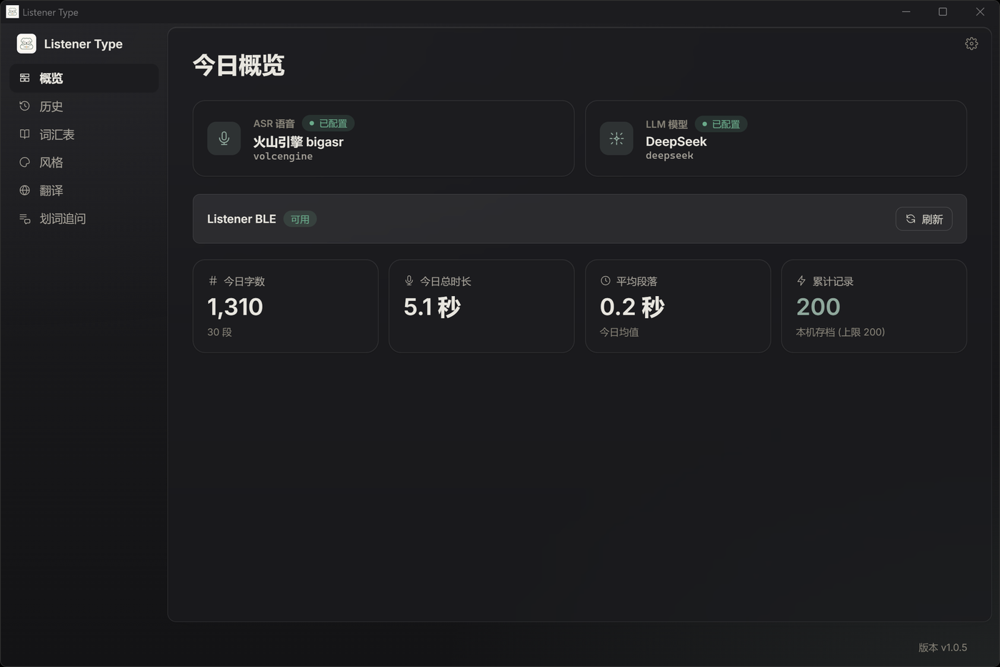

<picture>
  <source media="(prefers-color-scheme: dark) and (max-width: 600px)" srcset="docs/assets/listener/type-hero-mobile-dark.png">
  <source media="(prefers-color-scheme: dark)" srcset="docs/assets/listener/type-hero-dark.png">
  <source media="(max-width: 600px)" srcset="docs/assets/listener/type-hero-mobile.png">
  
</picture>

**简体中文** · [English](README.md)

# Listener Type

**用说话起草长消息、邮件或笔记，文字回到你正在使用的输入框。**

**[下载 Windows 版](https://github.com/Listener-ai-Macau/Listener-Type/releases)** · [首次设置](#先完成一次输入) · [折页说明书](docs/manuals/Listener-fold-ZH.pdf)

免费开源 · 键盘可选 · 首次需配置识别服务或本地模型。


## 不用离开正在写的地方

<picture>
  <source media="(prefers-reduced-motion: reduce) and (max-width: 600px)" srcset="docs/assets/listener/Listener-demo-zh-mobile-poster.png">
  <source media="(prefers-reduced-motion: reduce)" srcset="docs/assets/listener/Listener-demo-zh-poster.png">
  <source media="(max-width: 600px)" srcset="docs/assets/listener/Listener-demo-zh-mobile.gif">
  
</picture>

1. 在目标输入框放好光标。
2. 按右 Ctrl 开始，说一句话，再按一次结束。
3. 检查写入的文字；目标应用阻止写入时，按提示粘贴。

图中是流程示意，不是实机录屏。默认 Raw 保留原文；需要时选择整理风格或翻译。

## 先完成一次输入

| 你现在有什么 | 从哪里开始 |
| --- | --- |
| 只有电脑 | 安装软件，允许麦克风访问，在「设置 → 录音」选择**电脑麦克风**。 |
| 已有 Listener 键盘 | 在「设置 → 设备」配对 `listener`，确认就绪；录音来源选 **Listener BLE**。 |

接着选识别服务：填写提供方要求的凭据与模型，或在本地识别设置中准备运行时和模型。先在记事本试一句话，看到文字再开始日常使用。

Windows 是主要安装与完整键盘音频路径。macOS / Linux 当前从源码构建，详见下方平台说明。

### 软件免费，服务费用分别计算

软件免费；云服务费用由提供方决定。没有 API Key，可先准备 Windows 本地模型并用 Raw 听写。

<details>
<summary>展开费用、本地模型与首次配置说明</summary>

- **软件：** Listener Type 免费开源；正常本机使用不需要 Listener 账号，也不必先买键盘。
- **云服务：** 使用你自己的语音识别或文字服务凭据，费用、额度和试用条件由对应提供方决定。软件不附带云端密钥。
- **没有 API Key：** Windows 可先在本地识别设置中准备 Foundry Local 运行时与 Whisper 模型，选择电脑麦克风，用原文模式（Raw）试录。本地识别无需云端识别密钥；首次需下载模型，速度取决于电脑。整理、翻译与语音问答另有服务配置要求。

[查看识别服务与本地模型设置](docs/USAGE.md#provider-和网络)

</details>

## 从原话，到你需要的表达

| 你的需要 | 对应能力 |
| --- | --- |
| 直接记录原话 | 原文模式（Raw）、录音胶囊预览、光标插入与剪贴板回退 |
| 整理聊天、邮件或任务 | 轻度整理（Light）/ 结构化（Structured）/ 正式表达（Formal），支持风格包编辑与 ZIP 导入导出 |
| 换一种语言表达 | 先选目标语言，录音中按 Shift 启用本次翻译 |
| 少改几次专有名词 | 本机词库、预设、字面纠错规则 |
| 对一段文字提问 | 选中内容，Ctrl+Shift+; 打开问答窗口，再用录音键提问 |
| 找回刚才的结果 | 历史查看、复制、删除与保留期限设置 |

流式插入开关默认开启，实际是否逐段写入取决于平台、模式和服务。录音胶囊里的文字是预览，不代表已经写入目标输入框。

**问答配置：** 语音提问目前固定使用火山引擎流式识别，需配置 App Key / Access Key 和文字服务；普通听写的其他识别服务或本地模型不能替代这项配置。

**默认是原文模式（Raw），整理和翻译按需配置。** 下面是选择轻度整理（Light） 并配置文字服务后的示意，不是准确率或逐字输出承诺：

> 说：“嗯，提醒我明天下午三点开会。”  
> 整理示意：“提醒我明天下午三点开会。”

## 一只旋钮，四个按键，六颗状态灯

**键盘为可选配件，目前处于预售阶段，购买入口尚未公布。软件可先独立使用。**

<picture>
  <source media="(prefers-color-scheme: dark) and (max-width: 600px)" srcset="docs/assets/listener/usage-scene-zh-mobile-dark.png">
  <source media="(prefers-color-scheme: dark)" srcset="docs/assets/listener/usage-scene-zh-dark.png">
  <source media="(max-width: 600px)" srcset="docs/assets/listener/usage-scene-zh-mobile.png">
  
</picture>

实物照片与软件截图来自仓库；电脑、输入框和示例文字为场景示意。

在「设置 → 设备」连接键盘。旋钮单击开始 / 停止，旋转默认调音量；双击重置配对，持续长按到确认完成后关机。四键支持自定义单击、双击与长按。

唤醒词与声纹也在**设备页**配置：按引导录三次当前唤醒词；改词后重新录制。声纹用于减少输入干扰，噪声与多人说话时仍需检查最终文字。删除声纹不会关闭语音唤醒。声纹向导在本机生成受保护模板，完成后不保留原始样本录音。

[硬件操作与灯语](https://github.com/Listener-ai-Macau/Listener-Firmware) · [折页使用说明](docs/manuals/Listener-fold-ZH.pdf)

## 服务由你配置，数据去向看得清

设置、词库、风格和历史保存在本机，凭据使用系统凭据库。云端识别处理音频，云端整理、翻译与问答处理相关文字；本地识别搭配云端文字服务仍会发送文字。调试录音默认关闭。

可按服务选择直连、系统代理或自定义代理。远程市场默认未配置，正常的本机使用不依赖 Listener 后端或账号登录。

## 平台与当前范围

| 平台 | 当前路径 |
| --- | --- |
| Windows | MSI 安装包；电脑麦克风与主要 Listener BLE 音频、设备配置路径 |
| macOS 12+ | 规划中：Apple Speech 识别、辅助功能插入、正式安装包。当前可从源码构建：电脑麦克风、本地模型识别、全局快捷键 |
| Linux | 源码构建；电脑麦克风；X11 快捷键尽力支持，Wayland 使用桌面快捷键绑定 CLI |

标准安装包不注册系统输入法。自动唤醒与声纹不保证在任意距离、噪声或多人重叠场景下可靠分离。

<details>
<summary>查看软件界面</summary>



仓库现有截图；其中的统计和服务配置是示例。

</details>

## 文档与开发

遇到连接、录音或文字写入问题，可先查折页第 08 面。仍有问题时，查看[反馈说明](SUPPORT.md)，在[问题反馈页](https://github.com/Listener-ai-Macau/Listener-Type/issues)提供软件版本、系统和输入来源；使用键盘时一并提供固件版本。

[使用说明](docs/USAGE.md) · [功能目录](docs/product/features.md) · [发布记录](https://github.com/Listener-ai-Macau/Listener-Type/releases) · [贡献指南](CONTRIBUTING.md) · [安全](SECURITY.md)

Tauri 2 / Rust / React / TypeScript / Vite。完整桌面构建还需要 `third_party/denzic-platform` 子模块。

```bash
npm ci
npm run build
cargo check --manifest-path src-tauri/Cargo.toml
```

软件与固件分别开源。

[Apache-2.0](https://github.com/Listener-ai-Macau/Listener-Type/blob/master/LICENSE)
