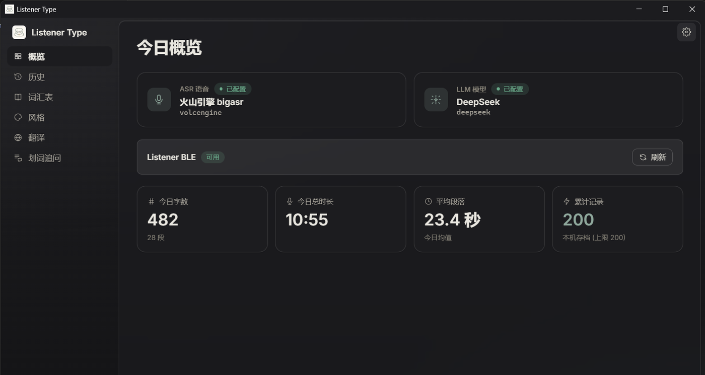
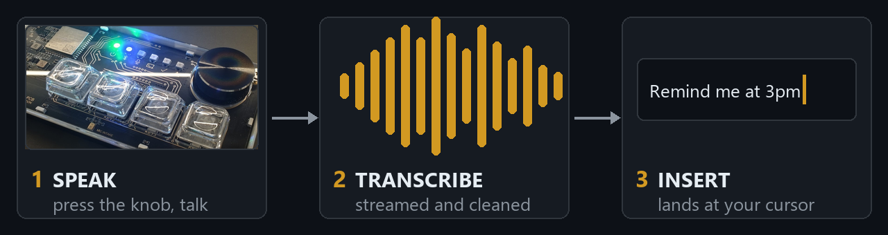
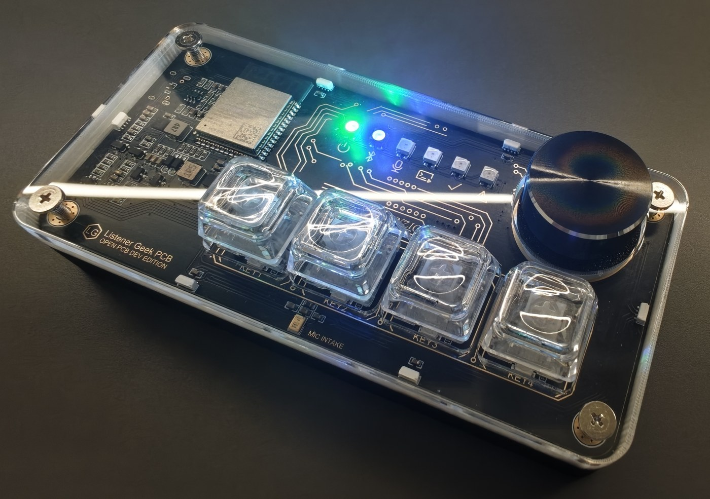
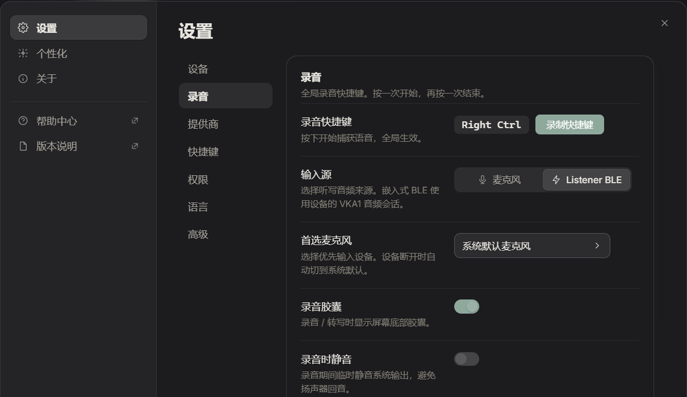

<p align="center">
  
</p>

# Listener Type

在正在工作的地方直接說，文字回到目前游標。Listener Type 把語音變成文字，還可以按需要去口癖、補標點、整理結構或翻譯。Windows、macOS、Linux 使用電腦麥克風就能執行；配上 Listener 語音鍵盤後，多了實體錄音控制、藍牙收音、狀態燈和裝置設定。

[English](README.md) · [简体中文](README.zh.md) · [下載](https://github.com/Listener-ai-Macau/Listener-Type/releases) · [使用說明](docs/USAGE.md) · [功能目錄](docs/product/features.md)

<p align="center">
  
</p>

## 一個產品，兩個倉庫

| 部分 | 負責什麼 | 倉庫 |
| --- | --- | --- |
| Listener Type | 錄音工作階段、語音辨識、文字處理、游標插入、設定、歷史和桌面端裝置體驗 | 目前倉庫 |
| Listener Firmware | 麥克風採集、BLE 音訊與 HID、按鍵、旋鈕、燈、電池與電源管理、診斷和 OTA | [Listener-Firmware](https://github.com/Listener-ai-Macau/Listener-Firmware) |

沒有語音鍵盤，軟體也能獨立使用。鍵盤擴充的是同一條聽寫流程；它本身不負責把語音辨識成文字。

## 30 秒開始使用

1. Windows 從 [Releases](https://github.com/Listener-ai-Macau/Listener-Type/releases) 安裝最新 MSI；macOS/Linux 可以從原始碼建置。
2. 允許麥克風權限，在設定 → 錄音中選擇「電腦麥克風」，並選一個辨識引擎：填入雲端服務 API Key，或下載本機模型（macOS 上 Apple Speech 開箱即用）。
3. 游標點進輸入框，Windows 按一下右 Ctrl，說話，再按一下；macOS 預設是右 Option。

結果會插回原來的游標位置。目標應用程式不允許直接插入時，Listener 會把文字保留在剪貼簿並提示貼上。錄音中按 `Esc` 可以取消。

## Listener 包含的完整能力

| 範圍 | 功能 |
| --- | --- |
| 聽寫 | 切換式錄音、手動停止、自動結束、取消、膠囊即時預覽、電腦麥克風和 Listener BLE 音訊 |
| 辨識 | 火山引擎串流、OpenAI 相容批次 ASR、Apple Speech、百鍊即時、macOS Qwen 本機辨識、Windows Foundry Local Whisper |
| 文字處理 | Raw、Light、Structured、Formal；語氣詞清理、標點、糾錯規則、翻譯、自訂風格包和 ZIP 匯入匯出 |
| 個人詞庫 | 人名、術語、縮寫和熱詞；供支援的辨識及潤飾服務使用 |
| 後續處理 | 對選取文字提問、為上一條結果切換風格、可設定全域快速鍵 |
| 輸出 | 目前焦點框插入、剪貼簿備援、可選 Windows TSF 驗證路徑、macOS 輔助使用插入 |
| 歷史 | 本機工作階段歷史、上一條結果、保留期限和可選診斷錄音 |
| Provider | 自備雲端 Key 或使用本機引擎；每個服務可選直連、系統代理或自訂代理 |
| 桌面體驗 | 系統匣、開機啟動、單一執行個體、深色模式、更新介面、權限狀態和診斷包匯出 |
| 語音鍵盤 | 配對與健康狀態、四顆自訂鍵、按壓/旋轉旋鈕、燈光亮度、低功耗時間、電量、韌體線上升級（OTA）和裝置復原 |

## 從說話到游標

<p align="center">
  
</p>

> **你說**：「呃明天那個，就是，下午三點的會，幫我記一下」
>
> **你得到**：「明天下午三點的會，幫我記一下。」

Light 清理獨立語氣詞並補標點，同時保留原意；Structured 整理需求和筆記；Formal 收拾商務表達；Raw 儘量保持辨識原文；翻譯按已選目標語言輸出。潤飾服務不可用時，Listener 會保住可用的辨識原文，不讓整段聽寫遺失。

## Listener 語音鍵盤

<p align="center">
  
</p>

在設定 → 裝置中配對。單擊旋鈕開始或停止，雙擊重設配對，長按關機，旋轉可調音量或亮度。KEY1–KEY4 的單擊、雙擊、長按都能設定動作。PWR、BLE、REC、AI、OK、WARN 六顆燈替裝置說話，完整「燈語」見韌體倉庫的[燈效說明](https://github.com/Listener-ai-Macau/Listener-Firmware/blob/master/README.zh-TW.md#燈在說什麼)。

自動語音開始可以等待自訂喚醒詞，並可錄三段引導聲紋作為輸入保護。聲紋不是身分認證。韌體可以在 Listener Type 中 OTA，正常升級會保留配對和裝置設定。

詳細操作見[語音鍵盤手冊](docs/quickstart/voice-keyboard-readme.md)和[韌體倉庫](https://github.com/Listener-ai-Macau/Listener-Firmware)。

<p align="center">
  
</p>

## 本機優先

設定、歷史、詞庫、風格和糾錯規則保存在電腦上。Provider 憑證進入系統憑證庫，應用程式不內建任何服務商 Key。可選診斷錄音預設關閉。診斷包用於報告產品和連線狀態，設計上不包含 API Key、錄音和轉寫正文。

核心使用鏈路不依賴 Listener 自營後端。遠端市集和帳號功能只有明確設定相容後端後才啟用。

## 平台支援與目前邊界

| 平台或能力 | 目前範圍 |
| --- | --- |
| Windows | 主要發布路徑；支援電腦麥克風、Listener BLE 音訊與裝置控制、安裝包和游標插入 |
| macOS 12+ | 電腦麥克風、Apple/本機辨識路徑、全域快速鍵和輔助使用插入 |
| Linux | 電腦麥克風；X11 全域快速鍵盡力支援，Wayland 使用桌面環境綁定 CLI 命令 |
| 自動喚醒與聲紋 | 用於輸入便利和降低干擾；遠距離或嘈雜環境要複核最終文字 |
| 多人或重疊說話 | 仍在持續修復，1.0.5 不保證可靠過濾 |
| Windows 輸入法 | 標準安裝包向焦點框插入文字，不會把 Listener 註冊成系統輸入法 |

這些邊界屬於產品說明的一部分，詳細行為見[功能目錄](docs/product/features.md)。

## 版本脈絡

| 版本 | 產品進展 |
| --- | --- |
| 1.0.1 | 收攏為 Listener 獨立桌面產品，形成首套辨識、預覽和安裝包流程 |
| 1.0.3 | 完成喚醒靈敏度與誤觸發調整，並配套韌體音訊傳輸路徑 |
| 1.0.4 | 建立單人喚醒、停頓續說、自動結束和文字插入基線；多人隔離仍是實驗能力 |
| 1.0.5 | 改善喚醒後正文連續性、膠囊與終稿分離、輕聲喚醒和鍵盤回饋；遠距離與多人重疊仍在修復 |

準確安裝包、校驗值和逐版改動以 [GitHub Releases](https://github.com/Listener-ai-Macau/Listener-Type/releases) 為準。

## 下載與文件

- [最新發布](https://github.com/Listener-ai-Macau/Listener-Type/releases)
- [1.0.5 版本說明](docs/release/1.0.5.md)
- [使用說明](docs/USAGE.md)
- [產品功能目錄](docs/product/features.md)
- [語音鍵盤與裝置復原](docs/quickstart/voice-keyboard-readme.md)
- [安全策略](SECURITY.md)

## 從原始碼建置

Listener Type 使用 Tauri 2、Rust、React、TypeScript 和 Vite。

```bash
npm ci
npm run build
cargo check --manifest-path src-tauri/Cargo.toml
```

完整桌面建置還需要 `third_party/denzic-platform` 子模組。貢獻前請閱讀 [CONTRIBUTING.md](CONTRIBUTING.md)。本倉庫以 [Apache-2.0 授權條款](LICENSE) 開源。
