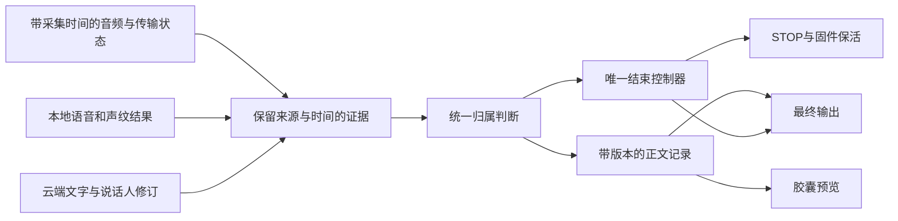

# Listener 录音体验与发布执行方案（待用户审核，v2）

日期：2026-09-14。执行者：Luna；审核者：用户指定的主代理。本文替代同名文档的 v1，是执行入口；旧修复记录作为历史证据，不作为新的默认行为合同。

## 0. 当前授权与交接

用户要求先审核方案，再让 Luna 执行。本轮只修改文档。未授权启动下面的开发、安装或发布阶段；用户批准本方案后，按任务卡依次执行，通过阶段门槛后自动继续，不必每个小步骤询问。

现有工作树有大量历史未提交修改。此前已写入部分换人候选代码，仅有部分针对性测试，未经完整链路验收；不能把这些代码认作成熟状态机，也不能直接安装。不得重置、覆盖或批量删除旧修改。先完成 P0 的身份核对和变更归档。

安装版、源码、构建目录可能不是同一内容。旧文档中的“当前包”“已修好”只代表当时。P0 实际查验结果是后续基准。发布状态统一由本方案的进度表维护，不能用老的成功记录代替当前候选证据。

## 1. 产品合同：用户审核这一部分即可

| 项目 | 合同 |
| --- | --- |
| 本人正常说话 | 持续讲话期间不自动 STOP，不因预览短暂停更或声纹单窗摇摆丢正文 |
| 正常自动结束 | 取最后一次有效本人语音的实际时间与最后一次已接受本人预览实质更新的显示时间，两者较晚者之后 1000 ms 结束；重复回调不续时 |
| 本人预览 | 可以在活动尾部修正识别结果；确认正文不因空包或晚到的旧事件整段消失 |
| 旁人和电视 | 不获得唤醒后的说话权；不续本人时钟，不进入最终正文 |
| 本人恢复说话 | STOP 尚未提交且新声音被确认属于本人时可恢复；STOP 提交后不把新一句偷偷拼回旧会话 |
| 结束与输出 | 停收音、最终稿处理、插入结果分别有状态；失败也结束加载并保留可恢复内容 |
| 语气词清理 | 开启时去独立的“嗯、呃”等犹豫词，保留标点、换行与有语义的词；关闭时不执行该清理 |
| 手动模式 | 右 Ctrl / EC11 仍可用；无登记声纹时不能声称具备同等本人识别能力 |
| 体验保护 | 不以修抗干扰为代价重新引入已证实的提前截断、正文清空、唤醒后锁死 |

必须明确一个边界：如果本人停顿超过 1 秒，且本人预览也已经稳定超过 1 秒，严格合同会结束本次听写。不能同时保证任意长思考停顿不断句。暂不根据“然后”“因为”或句号暗改为 2.5 秒；如果将来需要思考模式，应作为明确的产品选项另行决定。

“预览完成”不是云端能够预先保证的事件，本方案用“最后一次已接受本人预览的实质更新”定义。单纯动画、相同文字重复推送、与新语音无关的标点摆动不反复延长录音。云端 final 可能在 STOP 后才返回，不能等待 final 才开始计时。

“按时结束”与“判断谁在讲话”是两项能力。前者可以做确定性验证；后者必须用真实标注录音测量。模型尚未及时给出身份结论的场景记为未达标，不用延长等待来伪装成 1 秒通过。

## 2. 成熟系统可借鉴什么

| 公开依据 | 能支持的设计 | 不能推出的结论 |
| --- | --- | --- |
| [Google：Improved end-of-query detection](https://research.google/pubs/improved-end-of-query-detection-for-streaming-speech-recognition/) | 语音/静音检测与结束意图不同，需联合考量声学上下文 | 任意停顿都能被精确理解；固定阈值可以解决全部场景 |
| [Amazon：Two-pass endpoint detection](https://www.amazon.science/publications/two-pass-endpoint-detection-for-speech-recognition) | 先提出候选结束，再用额外证据验证，评估截断与延迟的共同变化 | Listener 应直接照搬模型，或额外仲裁可以不计耗时 |
| [在线目标说话人活动检测](https://www.isca-archive.org/interspeech_2022/wang22j_interspeech.html) | 按音频块跟踪“目标本人是否在说话”，区别于整段身份相似度 | 当前声纹模型已经具备该能力，或“两窗匹配”就是通用答案 |
| [Amazon Transcribe：Streaming and partial results](https://docs.aws.amazon.com/transcribe/latest/dg/streaming-partial-results.html) | 活动尾部可修订，稳定前缀与待定尾部应区别管理 | 稳定文字必然属于本人，或更长的结果必然更正确 |

上面是设计依据，不是对任何商业产品内部实现的猜测，也不是采用新模型的决定。下面的分层、验收数量和时延目标是 Listener 的工程提案，须由实验验证。

## 3. 已知证据与尚未证实的假设

以下会话编号仅用于寻找本机证据；恢复原日志后核对单位、时区、安装哈希及会话边界。

| 历史记录 | 已观察到的事实 | 尚不能声称 |
| --- | --- | --- |
| 4f2acc78-b49f-44bf-93a2-77f8fa8d9af8 | 预览间隙内发出 STOP，随后本人正文仍在增长，用户报告提前结束 | 后来加一条续时分支就全面解决 |
| 5563b70e-dca7-4f6e-a941-b4a282762217 | 旧链路 STOP 后约 12.161 s 完成，云端 final 已较早返回，尾部分离等待较长 | 只缩短分离超时就保证整个输出流程不挂 |
| 362bb641-2512-42d7-bfbf-6c6bfb3141fb | 干净长句回放中没有中途 STOP，STOP 到 Done 约 547 ms | 单轮合成回放代表真人所有语速 |
| 68ebb4b4-8a5e-49ee-bb97-3cdeb16278e9 | 旁人尾句进入最终文本，云端复用 speaker 0，本地短窗有摇摆；收尾约 1623 ms | 收尾变快等于 G 通过 |

已有报告：任务目录 work/owner-clock-fast-final-1-summary.json 和 work/owner-clock-fast-final-overlap-1-summary.json。它们的首预览以播放起点/后台字符增长估计，并未核对真实正文起音，不能直接用于首字 SLA。

需要验证的假设：

- H1：归属证据在适配层丢失或被其它路径绕过，造成非本人续时。
- H2：原始模型的本人/旁人短窗分数重叠，或结果到达太迟，单靠状态整理无法达标。
- H3：处理队列/推理竞争导致身份结果赶不上 1 秒截止。
- H4：已过滤文本被另一个预览或恢复入口重新带入 final。
- H5：固件交接或音频交付不完整导致少字，被误归因于 ASR。

先定位每个失败属于哪一类，再指定改动。允许多个原因共同存在，但一次实验只检验一个假设。

## 4. 目标结构与数据合同

保留当前模块划分，逐步收敛已有控制器；不全仓重写，不新增一个与旧控制器并行发 STOP 的控制器。



### 4.1 证据不能伪造

每项证据至少保存 session_id、来源、音频区间、单调到达时间、事件序号、质量/有效性、处理状态。数据缺失保持 Unknown。原始声纹分数不是“属于本人的概率”，未标定前不可当概率使用。

分开保存：最后原始语音区间、最后确认本人区间、身份已分析到的音频位置、provider 已覆盖位置、最后本人预览显示时间。不能用云端覆盖时长写入本人语音时间；不能把“疑似换人”伪装成已确认 NonTarget 时间戳。

统一归属输出至少区分：本人确认、已有本人连续段的有限不确定、疑似换人、确认旁人、静音、分析未完成。云端 speaker id 是聚类标签，不是用户身份。纯 VAD 只能说明有声音/语音。

本地结果晚到时，必须应用于对应的原始音频区间；不得按到达时间冒充“现在本人又说了”。同一音频的重复回调不能计作两次独立本人证据。重叠声纹窗口高度相关，不能当独立样本相乘。

### 4.2 生命周期与归属分开

生命周期：Listening → StopProposed → Finalizing → Done/Failed/Cancelled。
归属：Owner / Uncertain / HandoffSuspected / Other / Unknown。

普通静音后的候选结束与疑似换人的候选不是同一种证据，不能都强制“两次 Target”才恢复。普通静音后及时的本人语音可取消候选；疑似换人的恢复条件由 P2 标定，不能预设为 .75 或两次 .55。

- 归属明确时，deadline = max(last_owner_capture_time, last_accepted_owner_preview_visible_time) + 1000 ms。
- 身份未完成时，最多等待已有任务的有界预算；等待不更新本人时间。预算耗尽仍未知时保留音频/正文证据，记录降级；该条不算严格 1 秒验收通过。
- 换人候选暂存新尾部，保留原截止时间，不删除确认正文。候选不能因云端补回相同 speaker id 自动消失。
- 一次有效本人恢复应同步恢复端点与待定文字归属。恢复后不可因同一条旧负证据马上重新冻结。
- STOP 只提交一次；固件保活只由同一控制器派生。旧会话的 STOP/完成不能影响新会话。
- Finalizing 接收的是 STOP 边界以前尚未排空的音频/结果，不接收后续新话题重新续时。

### 4.3 正文只有一个事实来源

在现有 transcript ledger 上补版本与归属，不再维护互相兜底的“最长字符串赢家”。

条目包含会话、音频区间、provider 修订号、文本、归属证据引用、Pending/Accepted/Excluded 状态。显示、final 与恢复都从这些条目派生；显示出去不自动升级为 Accepted。

- 确认前缀受保护；活动尾部允许正常 ASR 修订。
- Pending 尾部可暂存；不明确属于本人的文字不得进入不可回撤的光标插入。
- Excluded 不能被原文、旧预览或本地补字恢复；恢复本人时按区间新增证据。
- 不能因为全文更长就优先；也不能因一个可疑尾段清空整段本人正文。
- 本地补缺句仅在同一 PCM、同一本人区间、有稳定左右锚点且不冲突时允许；无证据不得猜补。
- 无词级时间戳时明确能力限制，禁止按字符数比例臆造说话人切点。

流式插入已发出的外来文字无法靠 final 裁尾自动撤回。P5 必须覆盖真实流式模式，不能只在关闭插入的测试模式里宣称 G 修好；任何默认设置变化先记录产品影响，按已批准合同处理。

### 4.4 结束等待有总期限

P3 先拆解：请求 STOP → 设备结束确认 → PCM 排空 → 云端 final → 归属收敛 → 润色 → 插入 → 胶囊结束。
检查并行关系、锁、工作队列、取消行为。超时返回不等于后台推理已停止，禁止留下竞争下一会话的无限任务。

先为默认听写路径设 proposed 目标：STOP 到最终文本 ready 的 p95 ≤ 1800 ms；2000 ms 时必须有明确终态或明确的可恢复降级，不能还在无说明转圈。插入失败单独报告；启用远程润色的路径单独预算，不谎称所有外部服务都能 2 秒成功。

## 5. 验证机制：先证明它能发现错误

### 5.1 证据集

P1 创建本地 manifest，每条包含：case_id、音频路径与 SHA256、素材来源（现场真人/历史真人/拼接/合成）、登记声纹与播放设置、人工标注的本人/旁人起止、允许转写变体、预期停止区间、日志/安装身份、用途（开发/保留验收）。

真人语音与其合成替代不混算；同一人的原录音和增益/重采样衍生版本必须同组，防止开发/验收泄漏。没有身份标注不能算声纹准确率。没有起音标注不能算首字延迟。只有日志的历史案例只能验证已观测事件路径。

事件回放必须逐时消费当时可见证据，保留原回调到达顺序；不能把 final 标签提前用于在线 STOP 判断。未记录的事件不补造“成功时间线”。事件回放不验证原始模型、真实麦克风和线程负载。

### 5.2 最小联合矩阵

| 编号 | 场景 | 必须测到 |
| --- | --- | --- |
| A1–A3 | 短口令、正常口令、慢口令；负例后再唤醒 | 唤醒成功率、唤醒延迟、下一会话可用 |
| B1–B3 | 无口令本人闲聊、旁人/电视、安静 | 正式误唤醒次数/有效观测小时、任何外来输出 |
| C1–C4 | 短句、20–60 s 长句、预览延迟、本人轻声/跨句 | 连续本人不提前 STOP；最后活动到 STOP |
| C5 | 本人停顿 0.4/0.8/1.2/2 s，分别有/无迟到预览 | 按第 1 节时间合同判定；长停顿正常结束不标成 bug |
| D1–D3 | 手动 STOP、自动 STOP、STOP/ACTIVATE 交接 | 音频完整性、尾词保留、无错会话停止 |
| E1–E3 | 漏分句、语气词开/关、数字/中英混合 | 逐段缺失/重复、标点、不得猜补 |
| F1–F3 | 正常云端、final 延迟/缺失、分离/润色卡住 | 首字/预览间隔/ready/Done 分项耗时、取消后的资源释放 |
| G1–G4 | 本人后旁人、相似声线、电视继续、本人恢复/重叠 | 外来字数、外来续时长度、本人召回；重叠单独统计 |
| R1–R3 | 连续会话、BLE 断连重连、无声纹与手动对照 | 不锁死、无跨会话污染、功能保持 |
| R4 | 日常流式插入开启 | 历史最终稿与实际插入分别确认，旁人不得先插后藏 |

A–G 是工作分类，C/D 的旧记录有重叠；保留原问题引用，不因改编号关闭旧问题。

### 5.3 两级门槛

以下数值是待审核的工程验收目标，不是已经实现的性能。

开发门槛：所有已确认的历史代码故障有失败前证据与修复后事件级验证；判定器至少能抓住“提前 STOP、旁人续时、外来 final、重复插入、一直 Finalizing”五种人为注入故障。应使用真实生产决策函数，不能写一份模拟逻辑代替产品。

候选门槛：上述矩阵适用项在同一安装包下完整跑一轮；核心 C/E/G 各至少 3 轮，保留失败，不能只挑最好一次。首次出现本人截断、整句丢失、外来插入、会话锁死立即拒绝候选。

对外发布门槛：
- 至少 30 条不同文本的本人听写，覆盖短长句、轻声、停顿；零新增截断/漏整句/重复整句。
- 至少 30 次不同语速/间隔的正向唤醒，观察成功率并逐条解释失败；发布候选不允许未解决的确定性漏唤醒。
- 至少 20 条带人工身份标注的干扰案例，覆盖至少 3 个非本人声源且含真实第二人；零外来插入/最终字，报告干扰续时与本人丢失。
- 至少 2 小时分场景背景负例，零正式误唤醒输出；失败出现则该风险未关闭。
- 时延报告 n、p50、p95、max。有效样本少于 20 不宣称稳定 p95。正常无歧义自动结束 1000–1200 ms；首正文预览从真实起音计算，目标 p95 ≤ 1500 ms，超过 2 s 的缺口逐项解释。
- 正常 ready 目标按 4.4；若硬限制触发降级，报告比例和损失，不能把超时取消算成成功完成。
- 安装升级/回退、数据保留、实际光标输出、BLE 恢复、低功耗分别有证据。

这不是“永远不会错”的证明。2 小时零事件对长期误唤醒率的统计约束很弱；小样本通过只能支持受限环境候选。公开宣称更广泛商业可用前，需要扩大不同真人、设备与环境的试用。样本不足标 UNVERIFIED，不能补一个“通过”。

## 6. Luna 顺序任务卡

每次只做当前卡。先读取进度表和本卡指定文件，完成后写证据；不每轮重读三周历史，也不每次全量构建。模块路径相对 Listener-Type 根；固件仅在 P6 明确需要时进入。

### P0 — 冻结基线和恢复现场

输入：AGENTS.md、本方案、git status、已安装 exe、进程路径、固件 build id、现有设置与安装包。
操作：记录已跟踪 diff 和未跟踪文件清单/校验值，保存可恢复快照；分开标记“用户认可的历史体验包”“当前安装包”“当前源码草稿”。查清现有测试设置，只有确认是测试改动才恢复原设置；不得覆盖用户后来的设置。
输出：baseline.md，含身份、测试模式、回退包及验证方式；变更归属清单。
门槛：能恢复到明确的可用包且不丢用户数据；不把历史包的日志计为新候选验收。
失败：找不到对应包/源码就标身份未核实，继续整理证据，暂不安装。
范围：归档与环境核对，无业务改动。

### P1 — 固定数据和验证判定器

输入：第 3/5 节、本机 work/ 中的失败报告、现有 capture/summary 脚本。
操作：先找现成素材，生成 manifest；补手工时间标注；将三类延迟分开测量；排除播放前已开始的会话、缺日志、串错 session。
输出：cases.json、measurements.md、可重复运行的事件回放入口和命令。
门槛：旧故障判失败；正常对照不误判；五类注入故障被捕获。缺失素材有清单。
失败：修判定器或采集覆盖，不改业务代码去迁就错误报告。
范围：测试工具与本地证据，尚不运行新固件/安装包。

### P2 — 证明身份判断是否够用

输入：已标注本人/旁人 WAV，src-tauri/src/speaker_verification.rs，现有本地语音窗口/推理队列代码。
操作：从同一实收 PCM 重放现有模型，输出原始得分、信号质量、音频区间、排队/推理延迟；分别统计本人误拒、旁人误接、首次可用换人判断耗时。比对干净与干扰，在开发集标定，保留集验收。
输出：identity-feasibility.md，明确 H1/H2/H3 哪些有证据，推荐一项实现路径。
门槛：证明在线可用证据能在截止预算内区分必测场景；若仅系统接线错则走 P4，若算力/模型不足先停在本卡。
失败：若模型分数无法区分，最多对一个有公开来源、许可和部署可行性的候选方案做同 PCM 对照；不得无限调阈值。仍不足则提交能力缺口与取舍给审核者。
范围：诊断与离线评测；换模型/新增云端费用方案先由审核者判断。不得用“连续两窗”替代本卡结论。

### P3 — 修复收尾等待的确定性故障

输入：5563b70e 日志，coordinator/dictation.rs、asr/volcengine.rs 的 finish 与分离路径，胶囊状态转换。
操作：对照 4.4 画真实调用时间线；建立一次总 deadline，取消/丢弃迟到结果；让正常 final 尽早可用。验证错误路径也解除加载并保留本人结果。
输出：一项聚焦补丁、故障注入测试、各阶段耗时。
门槛：final 已返回不能再无意义等完整多轮分离；任务超时不累积后台工作；下一会话仍可用。
失败：若 2 秒与必要处理不可兼得，列出实际耗时和可降级方式，不擅自丢掉重要正文。
范围：收尾生命周期，不改唤醒与声纹全局阈值。

### P4 — 统一归属与结束计时

依赖：P1/P2 完成；可复用 P3 总 deadline。
输入：speech_decision_kernel.rs、coordinator/dictation_endpoint_clock.rs、dictation_endpoint_policy.rs、dictation_target_speaker_update.rs、asr/volcengine.rs。
操作：先把现有续时/STOP/固件 lease 调用入口列成一页；将 P2 可用证据送入单一控制器。显式表达疑似换人和分析未完成，处理取消、恢复、重复与迟到事件。逐步替换冲突路径，不新增旁路。
输出：控制器变更、事件决策理由、历史完整序列回放结果。
门槛：同输入必得同结果；生产路径与测试用同一函数；原始 VAD、旧回调、旁人不得续时；本人正例保持。覆盖先收到云端后收到本地和反向顺序。
失败：业务模型不够回 P2；控制流绕过则定位具体入口后修复，禁止盲加一个 bool。
范围：Type 在线录音控制；现有 handoff 草稿逐条评估，不默认保留。

### P5 — 统一预览、最终稿和插入

依赖：P4 的归属事实来源。
输入：asr/volcengine_transcript.rs、volcengine_untimed_merge.rs、coordinator/dictation_preview.rs、最终仲裁与插入入口。
操作：按 4.3 补正文记录的版本/归属与一次提交；去除旧预览重新带回 Excluded 的路径。确认语气词与漏句恢复只作用于本人内容。
输出：跨多分句/中英/标点的测试，确认前缀与活动尾部对照，最终稿来源记录。
门槛：不同 speaker id 的同一本人不丢句；相同 speaker id 的旁人不能复活；缺 final 有安全恢复；重复 Done 不二次插入。
失败：无足够时间/身份锚点时保留为未解决，不按字数猜切点。
范围：Type 正文与插入事实来源；用户要求日常流式插入保持可用。

### P6 — 闭环剩余 A/B/D 与设备路径

依赖：前面关键合同不回退。
输入：A/B/D 仍失败的实际证据；仅在需要时读取 Firmware/AGENTS.md、唤醒交接/采集/传输代码。
操作：分别处理无口令开录与漏唤醒，不靠收紧同一个阈值抵消；确认无登记声纹仍可按口令唤醒。检查包完整性、交接边界、终止锁与下一次会话。
输出：每个剩余问题的原因和聚焦补丁；必要的 app/firmware 配套版本表。
门槛：负例无输出且下一条正例能醒；手动/自动交接无尾词损失和跨会话 STOP。
失败：因听不清口令继续记录音频证据，不放宽成“本人随便说话就开录”。
范围：无固件证据则不刷固件；改变两端协议必须有兼容与回退方案。

### P7 — 冻结并构建候选

依赖：P0–P6 门槛通过，尚未解决项不得藏掉。
操作：运行相关测试与仓库要求检查，再构建一次包含这些已验证改动的 MSI；单独归档路径、源码摘要和 SHA256。新改动后旧构建测试结果失效。
输出：candidate.md、检查日志、可恢复候选快照、MSI 身份。
门槛：未新增失败；已有失败也要逐条列出是否影响发布；安装后 payload/进程/固件核对通过。
失败：构建错误本地修；不要安装半成品，不从其它目录复制 exe 冒充当前构建。

### P8 — 同一候选实机验收

输入：P1 manifest、P7 包、PC 扬声器→键盘麦克风→BLE→安装 Type。
操作：按固定矩阵播放与记录，监听时间覆盖素材结束后延迟误唤醒；检查最终输出、身份、STOP 和 Done。先做用户要求的最终结果验证，不使用记事本。
输出：每条 PASS/FAIL/UNVERIFIED、原始日志/WAV 引用、汇总指标、失败第一分歧时间点。
门槛：达到候选门槛。实际光标插入另用可控输入目标验收；关闭插入时的 insertStatus=failed 不算插入通过。
失败：一个核心回归即拒绝候选，恢复已归档可用包；把新故障纳入数据，回最早失败阶段。一次失败一个诊断假设，不连续换包碰结果。
范围：测试设置仅在测试窗口使用，try/finally 恢复并读回确认；后台录音原始音频只作本地证据，不提交公开仓库。

### P9 — 发布准备与有限试用

依赖：P8 通过；收集缺少的真人/环境覆盖直到达到第 5 节发布门槛。
操作：核对 updater、签名、版本、许可证、模型/素材分发许可、干净账户安装、升级/回退与历史数据保留。核对 GitHub 功能说明没有把未验证能力写成保证。
输出：release-readiness.md、用户可读的已知限制、最终安装/固件身份、全部未通过项。
门槛：对外发布所述能力均有证据；先内部候选/受限试用，稳定渠道按实际覆盖放行。
失败：缺真人第二人/时长/签名等外部条件时写清，需要用户协助的仅问这一项，继续其它独立工作。
范围：发布材料先准备完整；是否外发依据届时用户授权，不能把“审核方案”解释为自动向公众推送。

## 7. 已存在的执行入口

路径约定：
- TypeRoot = C:\Users\Billy\Desktop\Denzic\Listener\Listener-Type
- TaskRoot = C:\Users\Billy\Documents\Codex\2026-09-12\c-users-billy-desktop-denzic-listener
- FirmwareRoot = C:\Users\Billy\Desktop\Denzic\Listener\Listener-Firmware

已核对存在的命令（从 TypeRoot 执行；仅在对应阶段运行）：

```powershell
cargo check --manifest-path src-tauri/Cargo.toml
cargo test --manifest-path src-tauri/Cargo.toml --lib
npm test
npm run build
npm run check:brand
npm run check:cloud
npm run check:traceability
npm run check:asr-latency
npm run check:multi-speaker-timelines
npm run check:target-speaker-overlap
npm run tauri -- build --target x86_64-pc-windows-msvc --bundles msi
pwsh -NoProfile -File scripts/verify_latest_runtime.ps1 -RequireRunning
```

不是每个阶段都跑这整份清单。模块修改期间只跑对应行为检查；完整清单在 P7 跑一次，有新更改或失败才重跑受影响项。每条命令检查退出码，不能用最后一个成功命令掩盖前面失败。测试筛选返回 0 个测试不能记 PASS。

TaskRoot/work 已有：physical-result-only.ps1、app-cdp.mjs、check-result-only.js、restore-recording-settings.js、summarize-preview-run.py。P1 先补足计时/恢复/会话关联缺口再复用，不无条件信任报告。原 restore 脚本写固定默认值，必须先确认用户实际设置，避免覆盖用户新偏好。

事件回放 manifest 和统一验收 runner 是 P1 要交付的产物，目前不要假称已经存在。本地任务证据须带哈希；将来可复用的测试工具整理到仓库 scripts，录音、凭据和完整用户文本不进入公开提交。

## 8. 费用控制与异常处理

- 一个执行者、一个当前任务卡。Luna 不再自行派生代理，不开多个模型重复阅读。
- 审核者主要核对实验预测、失败证据、生产路径与验收范围；正常小步骤由 Luna 连续完成。
- 每次修改前写一句：哪条证据支持哪个原因，修改后预期哪项变化，哪项必须保持。没有可反驳预测先不改。
- 一个原因最多两次受控修正；同类失败再次出现，停止改阈值，整理分歧证据交审核者。两次是费用保护，不是科学结论。
- 模型/声纹参数、provider 参数、固件与控制器不能同轮一起调。输入环境也固定记录。
- 优先复用原音频与离线事件；实机用于验证模型、设备、线程和输出集成。必要验证不能因省 token 省略。
- 不承诺“一次安装必过”；目标是每次失败产生可复用证据并缩小原因范围。
- 缺设备、接口策略拒绝或外部资源时明确记录事实；不将不可执行写成通过，也不反复重试相同命令。
- 不清理技能、改 GitHub 展示、升级依赖或重构无关模块来“顺便优化”。

## 9. 进度与移交格式

进度文件：luna-recording-execution-status-2026-09-14.md。状态仅允许：
WAITING_APPROVAL / READY / RUNNING / PASSED / FAILED / BLOCKED / UNVERIFIED。

每完成一张卡更新以下内容，并只读取下一卡必要上下文：

```text
当前卡：
输入版本/候选哈希：
发现（事实）：
当前原因（假设）：
改动文件及作用：
验证命令与退出码：
原始证据与期望/实际：
通过/失败/未验证：
尚未解决的产品影响：
下一卡或需要审核者判断的一项：
```

“PASSED”必须有可检查产物和原始证据。单元测试、模型音频评测、安装实机、真人现场、发布 readiness 分开记录。没有完整 A–G 联合证据时不能用“基本修好”“商业级完成”结束任务。
