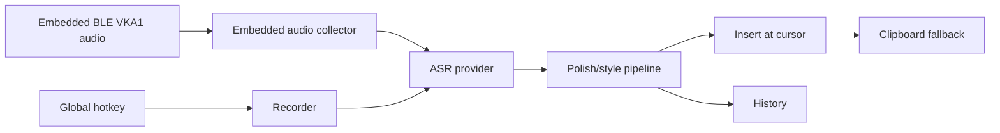

# Dictation Pipeline

Listener Type keeps the core voice input path small and explicit:



## Source Map

| Stage | Main files |
| --- | --- |
| Hotkey runtime | `src-tauri/src/global_hotkey_runtime.rs`, `src-tauri/src/hotkey.rs`, `src-tauri/src/combo_hotkey.rs`, `src-tauri/src/qa_hotkey.rs`, `src-tauri/src/shortcut_binding.rs` |
| Recording | `src-tauri/src/recorder.rs`, `src-tauri/src/audio_mute.rs`, `src/components/Capsule.tsx` |
| Embedded BLE audio | `src-tauri/src/embedded_audio.rs`, `src-tauri/src/embedded_ble.rs`, `src-tauri/src/coordinator/dictation.rs`, `src-tauri/src/commands.rs`, `src-tauri/src/cli.rs`, `tools/embedded_audio_replay/**` |
| ASR | `src-tauri/src/asr/mod.rs`, `src-tauri/src/asr/*`, `src-tauri/src/asr/local/**`, `src/pages/LocalAsr.tsx`, `src/lib/localAsr.ts` |
| Polish | `src-tauri/src/polish.rs`, `src-tauri/src/llm_*.rs`, `src/pages/Style.tsx` |
| Insertion | `src-tauri/src/insertion.rs`, `src-tauri/src/unicode_keystroke.rs`, `src-tauri/src/windows_ime_*`, `windows-ime/**` |
| State/history/diagnostics | `src-tauri/src/coordinator.rs`, `src-tauri/src/persistence.rs`, `src-tauri/src/commands.rs`, `src/pages/History.tsx` |

## Behavioral Rules

- `Esc` cancels current recording or processing.
- Each dictation session is independent; Listener Type does not answer the transcript as a chat agent.
- Clipboard fallback must preserve the generated result when direct insertion fails.
- Debug audio recording is opt-in and bounded by retention settings.
- Embedded audio keeps the firmware VKA1 packet model intact. Batch debug paths reconstruct a complete PCM session before ASR; streaming paths create the normal ASR consumer on `session_start`, feed each `audio_data` PCM chunk immediately, and finalize through the same `end_session` path on `session_stop`.
- Embedded streaming cancel/error/link-loss paths must cancel ASR, restore prepared IME state, return coordinator state to Idle, and show an error capsule.
- Local ASR providers use the same coordinator path as cloud providers after the provider is selected and prepared.
- Windows insertion may use the TSF IME bridge; clipboard/direct insertion fallback remains required so text is not lost.

## Embedded Debug Entrypoints

| Entrypoint | Behavior |
| --- | --- |
| `--submit-embedded-audio <wav-or-pcm>` | Batch file replay: builds VKA1 notifications, reconstructs PCM, then submits to dictation. |
| `--submit-embedded-audio-stream <wav-or-pcm>` | Streaming file replay: builds VKA1 notifications and feeds ASR chunk-by-chunk. |
| `--submit-embedded-audio-ble-once [timeout_ms]` | Batch BLE capture: waits for terminal packet, then submits reconstructed PCM. |
| `--submit-embedded-audio-ble-stream [timeout_ms]` | Streaming BLE capture: forwards notifications as they arrive and finalizes on terminal packet. |

For real hardware smoke, prefer `tools/embedded_audio_replay/run_ble_stream_smoke.ps1`. It starts the CLI with the main window hidden, uses COM3 `~VREC:TOGGLE` to simulate the EC11 recording key around the second TTS playback, and saves firmware serial logs. Add `-VerifyHistory` for P13.3 product-chain acceptance so the script checks that the history entry includes embedded BLE audio stats; add `-VerifyInsertion` only when the run should open a temporary Notepad target for automated cursor insertion checking. Manual key presses are only needed when validating the physical button itself.

## Verification

Run:

```bash
cargo test --manifest-path src-tauri/Cargo.toml --lib
cargo test --manifest-path src-tauri/Cargo.toml --lib --no-run
cargo test --manifest-path tools/embedded_audio_replay/Cargo.toml
npm run build
powershell -NoProfile -ExecutionPolicy Bypass -File tools/embedded_audio_replay/run_ble_stream_smoke.ps1 -Port COM3 -VerifyHistory
```

Platform smoke:

- macOS: microphone permission, Accessibility restart, hotkey start/stop, insertion into Notes or a text editor.
- Windows: microphone privacy, hook status, TSF registration, Notepad insertion.
