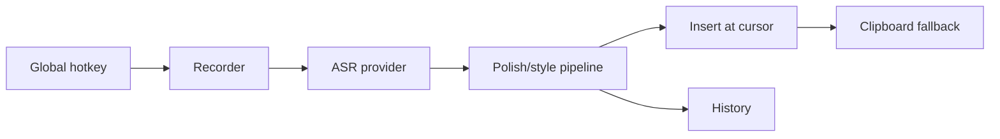

# Dictation Pipeline

Listener Type keeps the core voice input path small and explicit:



## Source Map

| Stage | Main files |
| --- | --- |
| Hotkey runtime | `src-tauri/src/global_hotkey_runtime.rs`, `src-tauri/src/platform_hotkey.rs`, `src-tauri/src/combo_hotkey.rs`, `src-tauri/src/qa_hotkey.rs` |
| Recording | `src-tauri/src/recorder.rs`, `src-tauri/src/audio.rs`, `src/components/Capsule.tsx` |
| ASR | `src-tauri/src/asr.rs`, `src-tauri/src/asr/*`, `src/pages/LocalAsr.tsx` |
| Polish | `src-tauri/src/polish.rs`, `src-tauri/src/llm_*.rs`, `src/pages/Style.tsx` |
| Insertion | `src-tauri/src/inserter.rs`, `src-tauri/src/windows_ime.rs`, `windows-ime/**` |
| State/history | `src-tauri/src/coordinator.rs`, `src-tauri/src/persistence.rs`, `src/pages/History.tsx` |

## Behavioral Rules

- `Esc` cancels current recording or processing.
- Each dictation session is independent; Listener Type does not answer the transcript as a chat agent.
- Clipboard fallback must preserve the generated result when direct insertion fails.
- Debug audio recording is opt-in and bounded by retention settings.

## Verification

Run:

```bash
cargo test --manifest-path src-tauri/Cargo.toml --lib
npm run build
```

Platform smoke:

- macOS: microphone permission, Accessibility restart, hotkey start/stop, insertion into Notes or a text editor.
- Windows: microphone privacy, hook status, TSF registration, Notepad insertion.
