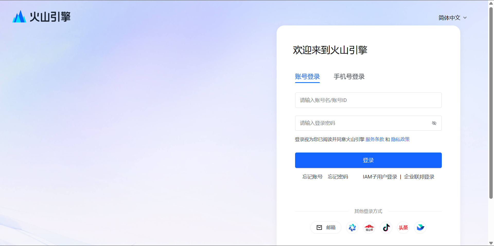
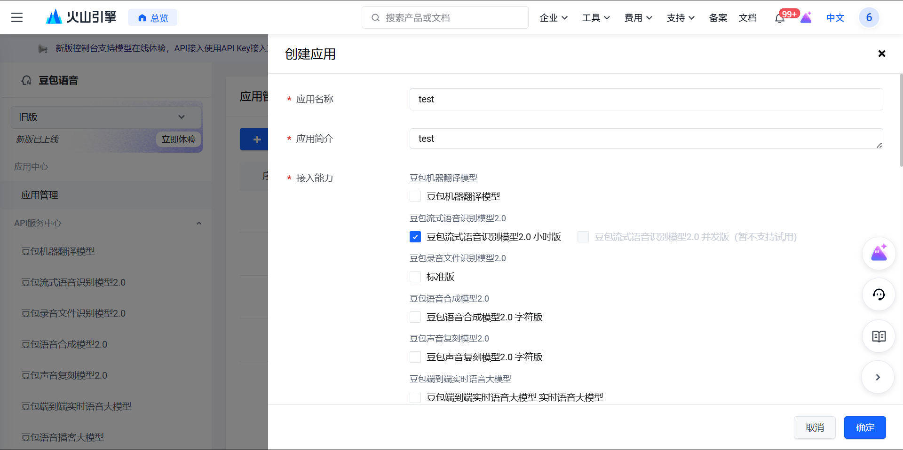
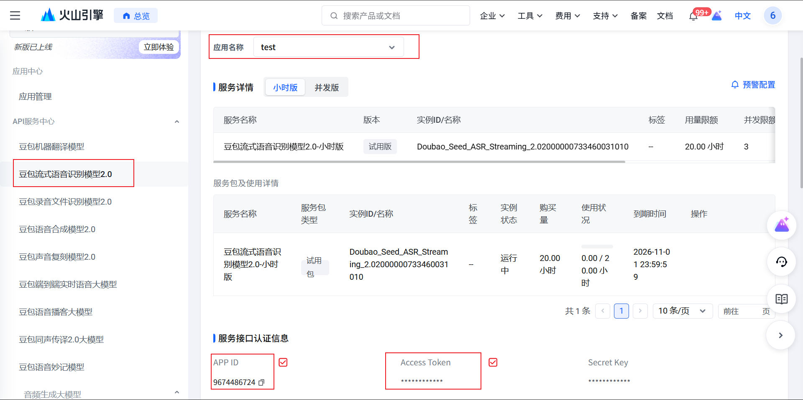

# Volcengine ASR Setup

Listener Type supports Volcengine streaming ASR. You bring your own account and credentials.

## Steps

1. Sign in to the Volcengine console.
2. Create or open a streaming ASR application.
3. Copy the App ID, Access Token and Resource ID.
4. In Listener Type, open Settings -> Recording.
5. Select Volcengine as the ASR provider and paste the three values.
6. Save and run a short dictation test.

## Reference Images

These inherited console screenshots show the provider-side setup flow:

The Listener Type settings UI has been rebranded and restyled, so provider console screenshots are retained while the old app settings screenshot is intentionally not reused.

## Troubleshooting

- Empty transcript: verify App ID, Access Token and Resource ID.
- HTTP or websocket authentication error: rotate the token and update Settings.
- Domain words recognized incorrectly: add Vocabulary entries and retry.
