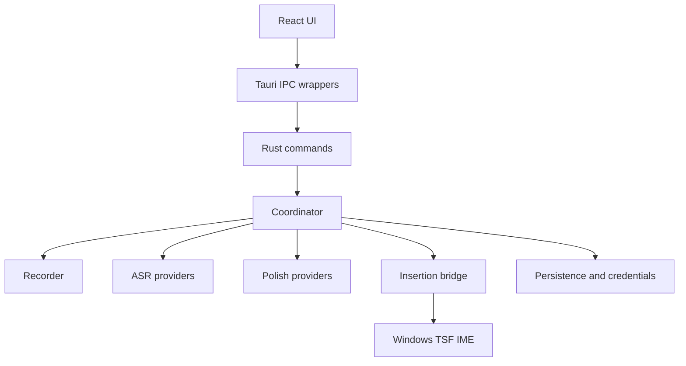

# Listener Type Architecture

Listener Type is a Tauri desktop app with a Rust backend and React frontend. The architecture is intentionally local-first: the app must remain useful without any Listener Type-hosted backend.

## Runtime Shape



## Frontend

- `src/App.tsx` selects the window surface.
- `src/components/FloatingShell.tsx` is the main app shell.
- `src/components/Capsule.tsx` is the compact recording/status window.
- `src/pages/*` implement product workflows.
- `src/lib/ipc.ts` owns typed frontend-to-backend calls and mock fallbacks.
- `src/styles/tokens.css` holds Listener Type design tokens.

## Backend

- `src-tauri/src/lib.rs` wires Tauri plugins, windows, tray, commands and platform setup.
- `src-tauri/src/coordinator.rs` coordinates recording, ASR, polish, insertion and history; helpers in `coordinator/support.rs`; session logic in `coordinator/dictation.rs` (+ `include!` siblings: preview/device_ai/wake_polish/session/embedded_submit/embedded_stream) / `qa.rs` / `resources.rs`; free-function domains via `include!` (`hotkey_device_runtime.rs`, `embedded_ble_runtime.rs`); tests path-separated (`coordinator_tests.rs`, `dictation_tests.rs`).
- `src-tauri/src/persistence.rs` stores settings, history, recordings, vocabulary, style packs and credentials.
- `src-tauri/src/commands/` is the IPC command surface: `mod.rs` (settings/credentials/history + thin device wrappers) with `include!` siblings (`style_pack_commands`, `local_asr_commands`, `diagnostics_export`, `marketplace`) and `device/{mod,settings,ble,firmware}.rs`. Unit tests in `commands_tests.rs`.
- `src-tauri/src/embedded_ble/` owns Windows BLE: `mod.rs` (shared types + public wrappers), `windows_ble/` (`mod.rs` + `include!` siblings: `unpair`, `pairing`, `pnp_cache`, `recording_control`, `capture_events`, `ota_transfer`, `notify_open`, `ota_open`, `gatt_open`), path-separated tests in `mod_tests.rs` / `windows_ble_tests.rs`.
- Provider modules live under `src-tauri/src/asr/*` and `src-tauri/src/llm_*.rs`.
- Maintainability gate: `npm run check:module-budgets` (Goals: `docs/goals/20260727-type-maintainability-excellent.md`, `docs/goals/20260727-type-maintainability-phase2.md`).

## Provider Network Policy

Cloud LLM and HTTP-compatible ASR providers use a per-provider proxy policy stored with that provider's credential entry in the OS credential vault. The default policy is provider-aware: common mainland China providers such as Ark, DeepSeek, SiliconFlow, Bailian, Volcengine, Zhipu, MiMo and Alibaba/Coding Plan endpoints use direct connections by default, while overseas, OAuth, aggregation and custom providers follow the system proxy by default.

Streaming WebSocket ASR uses the same resolved policy as HTTP ASR/LLM traffic. Direct mode opens the provider socket directly; system mode resolves the platform system HTTP proxy (with standard environment variables taking precedence and `NO_PROXY` respected); custom mode uses the saved HTTP proxy URL and an HTTP CONNECT tunnel. No machine-specific loopback proxy address is embedded in the binary. SOCKS-only proxies remain unsupported by the custom WebSocket transport and are reported as a connection error rather than silently switching modes.

Users can override each provider to direct, system proxy, or a custom HTTP proxy URL. Loopback endpoints (`localhost`, `127.0.0.1`, `::1`) always bypass proxies so local OpenAI-compatible servers keep working even when a stale system proxy is configured.

## Platform Bridges

- macOS uses Accessibility/keyboard event paths for hotkey and insertion.
- Windows uses low-level hooks for hotkeys and Listener Type TSF IME for reliable insertion.
- Windows IME identity is documented in `docs/platform/windows-ime.md`.

## Data Boundaries

- App data directory name: `Listener Type`.
- Logs: `Listener Type/Logs/listener-type.log`.
- Credential vault service: `com.listener.type`.
- Remote marketplace: disabled until `LISTENER_TYPE_MARKETPLACE_BASE_URL` is configured.
- GitHub OAuth: disabled until `GITHUB_OAUTH_CLIENT_ID` is configured with a Listener Type-owned app.

## Update Boundary

Updater metadata is scoped to `Listener-ai-Macau/Listener-Type`. Third-party mirrors are opt-in only.

## Traceability

Every tracked source/config/script file must appear in `specs/traceability/files.md`. Update it manually or run:

```bash
npm run check:traceability -- --write
```
