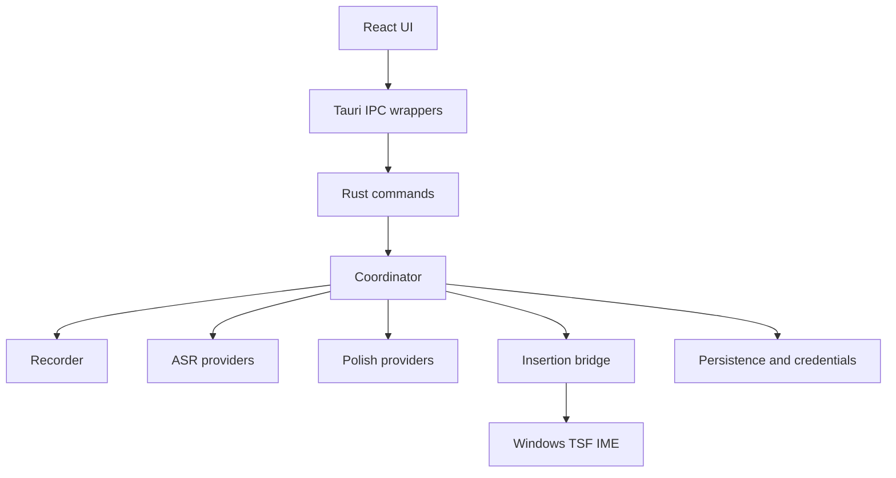

# Listener Type Architecture

Listener Type is a Tauri desktop app with a Rust backend and React frontend. The architecture is intentionally local-first: the app must remain useful without any Listener Type-hosted backend.

## Runtime Shape


```mermaid
flowchart TB
  UI["React UI"] --> IPC["Tauri IPC wrappers"]
  IPC --> Commands["Rust commands"]
  Commands --> Coord["Coordinator"]
  Coord --> Recorder["Recorder"]
  Coord --> ASR["ASR providers"]
  Coord --> Polish["Polish providers"]
  Coord --> Insert["Insertion bridge"]
  Coord --> Persistence["Persistence and credentials"]
  Insert --> WinIme["Windows TSF IME"]
```

## Frontend

- `src/App.tsx` selects the window surface.
- `src/components/FloatingShell.tsx` is the main app shell.
- `src/components/Capsule.tsx` is the compact recording/status window.
- `src/pages/*` implement product workflows.
- `src/lib/ipc.ts` owns typed frontend-to-backend calls and mock fallbacks.
- `src/styles/tokens.css` holds Listener Type design tokens.

The recording capsule renders the newest accepted preview in one update. It
does not replay provider text through a separate character-reveal timer; clause
commitment and provisional text remain backend decisions.

## Backend

- `src-tauri/src/lib.rs` wires Tauri plugins, windows, tray, commands and platform setup.
- `src-tauri/src/coordinator.rs` coordinates recording, ASR, polish, insertion and history; helpers in `coordinator/support.rs`; session logic in `coordinator/dictation.rs` (+ `include!` siblings: preview/device_ai/wake_polish/session/embedded_submit/embedded_stream) / `qa.rs` / `resources.rs`; free-function domains via `include!` (`hotkey_device_runtime.rs`, `embedded_ble_runtime.rs`); tests path-separated (`coordinator_tests.rs`, `dictation_tests.rs`).
- `src-tauri/src/persistence.rs` stores settings, history, recordings, vocabulary, style packs and credentials.
- `src-tauri/src/commands/` is the IPC command surface: `mod.rs` (settings/credentials/history + thin device wrappers) with `include!` siblings (`style_pack_commands`, `local_asr_commands`, `diagnostics_export`, `marketplace`) and `device/{mod,settings,ble,firmware}.rs`. Unit tests in `commands_tests.rs`.
- `src-tauri/src/embedded_ble/` owns Windows BLE: `mod.rs` (shared types + public wrappers), `windows_ble/` (`mod.rs` + `include!` siblings: `unpair`, `pairing`, `pnp_cache`, `recording_control`, `capture_events`, `ota_transfer`, `notify_open`, `ota_open`, `gatt_open`), path-separated tests in `mod_tests.rs` / `windows_ble_tests.rs`.
- Provider modules live under `src-tauri/src/asr/*` and `src-tauri/src/llm_*.rs`.
- Maintainability gate: `npm run check:module-budgets` (Goals: `docs/goals/20260727-type-maintainability-excellent.md`, `docs/goals/20260727-type-maintainability-phase2.md`).

The continuous BLE actor owns both the logical dictation session and its current physical audio segment. A new physical `SessionStart` can reset collector statistics, so the actor settles a predecessor `STOP` before admitting an unrelated segment. A request-tagged ENSURE continuation or an active activation race guard may carry the same logical dictation into the new segment; binding it clears the predecessor's tail-drain deadline. An untagged segment cannot inherit the old session by arrival time alone.

The continuous listener renews Type readiness every eight seconds, including
during live audio. The firmware's visible readiness lease can be shorter than
its audio transport lease, so transport availability alone cannot justify
postponing a heartbeat. A single periodic GATT write is polled asynchronously;
audio notifications and urgent ENSURE/STOP requests continue while it is
pending. Failed or cancelled writes retain recovery ownership. Cleanup cancels
a pending renewal before BYE, notify teardown, or an OTA handoff.

Dictation delivery follows the OS foreground cursor at each stable clause and at final dispatch. The session-start window is context for style and diagnostics, never a window to raise or restore. A TSF composition is tied to one editor; switching windows cancels its reversible composition and continues through the current-cursor paste route. Preview text may change while it is provisional. Once a stable clause is committed to the editor, it is immutable: the stop result can append only an uncommitted tail, never select or replace an earlier clause. Automatic wake uses the same prefix stripper for the early-delivery gate as for the final transcript, so a bounded hesitation before the wake phrase cannot suppress all live delivery.

## Provider Network Policy

Cloud LLM and HTTP-compatible ASR providers use a per-provider proxy policy stored with that provider's credential entry in the OS credential vault. The default policy is provider-aware: common mainland China providers such as Ark, DeepSeek, SiliconFlow, Bailian, Volcengine, Zhipu, MiMo and Alibaba/Coding Plan endpoints use direct connections by default, while overseas, OAuth, aggregation and custom providers follow the system proxy by default.

Streaming WebSocket ASR uses the same resolved policy as HTTP ASR/LLM traffic. Direct mode opens the provider socket directly; system mode resolves the platform system HTTP proxy (with standard environment variables taking precedence and `NO_PROXY` respected); custom mode uses the saved HTTP proxy URL and an HTTP CONNECT tunnel. No machine-specific loopback proxy address is embedded in the binary. SOCKS-only proxies remain unsupported by the custom WebSocket transport and are reported as a connection error rather than silently switching modes.

Users can override each provider to direct, system proxy, or a custom HTTP proxy URL. Loopback endpoints (`localhost`, `127.0.0.1`, `::1`) always bypass proxies so local OpenAI-compatible servers keep working even when a stale system proxy is configured.

## Platform Bridges

### Streaming delivery ownership

The delivery ledger keeps immutable submitted editor text and a separate consumed
provider-prefix key. An accepted clause advances both coordinates atomically;
failed delivery restores both. Subsequent ASR revisions reconcile against the
provider coordinate, so correcting an earlier word cannot stall or replay later
clauses. Finalization submits only the uncovered tail.

Rolling delivery stability compares spoken content over the existing one-second
window and uses the newest clause punctuation. A late comma or question mark
does not restart a stable body's timer. Numeric separators, literal operators,
and word spacing remain content for stability. A consumed prefix uses the same
shared content coordinate as delivery; formatting changes before that boundary
cannot delay its continuation. Unmapped source revisions retain full-prefix
checks, and current speaker admission still applies.

A bounded provider revision with a uniquely retained terminal source boundary
can certify that no body remains unsubmitted, even if exact prefix matching
fails. This path can append only missing boundary punctuation. Ambiguous
boundaries, repeated anchors, and genuine new body growth remain outside this
certificate and use the existing continuation/recovery checks.

Speaker exclusions apply to their audio intervals. A retained foreign row still
vetoes raw final recovery, while fresh verified owner speech after that interval
can continue into the live ledger. The receive frame uses the same accepted owner
view for preview promotion and the following merge.

When recording diagnostics are enabled, a private `*.delivery-trace.json` beside
the session WAV records intended text, cumulative submitted text, source coverage
and target acknowledgment separately. Submission alone is not editor readback;
preview/final differences alone do not prove lost or duplicated text.

- macOS uses Accessibility/keyboard event paths for hotkey and insertion.
- Windows uses low-level hooks for hotkeys and Listener Type TSF IME for reliable insertion.
- Windows IME identity is documented in `docs/platform/windows-ime.md`.

## Data Boundaries

- App data directory name: `Listener Type`.
- Logs: `Listener Type/Logs/listener-type.log`.
- Credential vault service: `com.listener.type`.
- Remote marketplace: disabled until `LISTENER_TYPE_MARKETPLACE_BASE_URL` is configured.
- GitHub OAuth: disabled until `GITHUB_OAUTH_CLIENT_ID` is configured with a Listener Type-owned app.

## Update Boundary

Updater metadata is scoped to `Listener-ai-Macau/Listener-Type`. Third-party mirrors are opt-in only.

## Traceability

Every tracked source/config/script file must appear in `specs/traceability/files.md`. Update it manually or run:

```bash
npm run check:traceability -- --write
```
